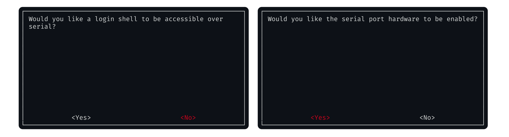
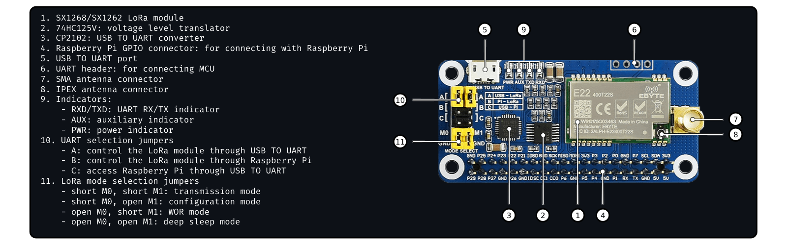
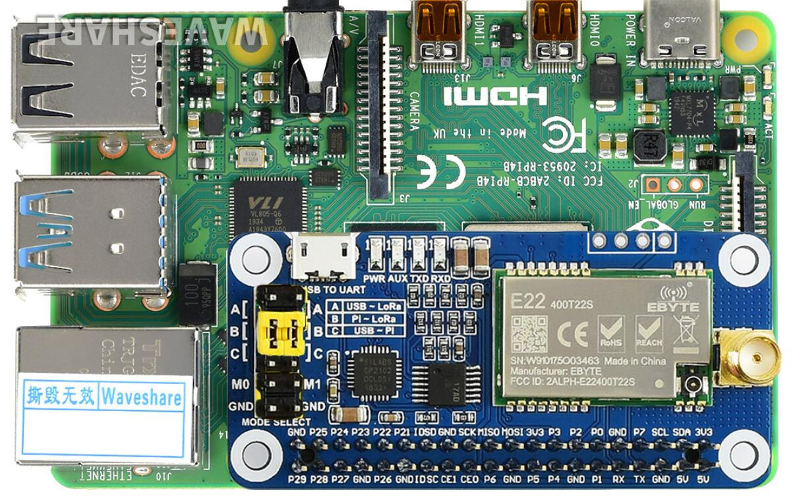
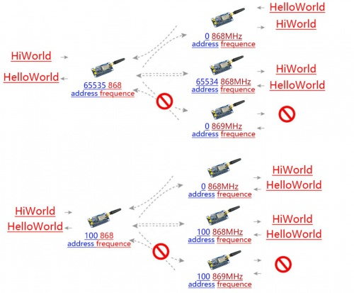

# 

<ins> Encrypted Long-Range Radio Communication </ins>, Powered by [Raspberry Pi](https://en.wikipedia.org/wiki/Raspberry_Pi) and the LoRa protocol, this project enables secure, offline communication between two nodes using various encryption algorithms, security techniques, and the [LoRa radio protocol](https://en.wikipedia.org/wiki/LoRa). Access the secure web interface via local-nework when connected to the Raspberry Pi's personal hotspot. This setup ensures data privacy and integrity over long distances, making it ideal for scenarios requiring private communication without traditional internet infrastructure.

## Hardware Requirements

To implement this project, each node should have the following hardware. While you can adapt this concept to suit other devices, here's the most cost-effective and widely supported setup:

- **Raspberry Pi:** [Raspberry Pi Zero WH (With headers)](https://thepihut.com/products/raspberry-pi-zero-wh-with-pre-soldered-header) / [Raspberry Pi Zero 2 W (With headers)](https://thepihut.com/products/raspberry-pi-zero-2) / [Raspberry Pi 3B ](https://thepihut.com/products/raspberry-pi-3-model-b)
- **LoRa HAT:** [SX1268 LoRa HAT for Raspberry Pi (433MHz)](https://thepihut.com/products/sx1268-lora-hat-for-raspberry-pi-433mhz) ([docs](https://www.waveshare.com/wiki/SX1268_433M_LoRa_HAT))

**Note:** For a basic point-to-point communication system, you'll need two of each items above (*I'm using a Raspberry Pi Zero WH*).

## Getting started

You will need two nodes as described above. Once both nodes are set up, you can either use a [pre-created image](https://github.com/NotReeceHarris/rpi-lora-comms/releases) or follow the setup guide.

If you prefer to complete the setup manually or encounter issues with the installer, please refer to the [manual setup guide](documentation/setup.md). For the installer, you must first enable the serial ports. To do so, run the command `sudo raspi-config`, then navigate to: Interfacing Options → Serial → No → Yes.



Once you have enabled the serial port hardware and disabled the login shell over serial, your LoRa component will be ready for communication after properly configuring the SX1268 LoRa HAT jumpers. First, remove all yellow jumpers from the UART selection jumpers **(10)** and LoRa mode selection jumpers **(11)**. Next, add jumpers to B on the UART selection jumpers **(10)**. You do not need to reconnect any of the LoRa mode selection jumpers **(11)**, as the board will be powered via the Raspberry Pi's GPIO pins. The attached image provides a clear visual guide for the jumper configurations.



<details>
<summary>Correctly configured jumpers. </summary>
<br>

</details>

Next, you need to install the software. Below is an automatic installer that is ideally suited for use on a fresh OS image. If you prefer manual installation steps, they are [available here](documentation/setup.md).

```bash
/bin/bash -c "$(curl -fsSL https://raw.githubusercontent.com/NotReeceHarris/rpi-lora-comms/HEAD/system/raspberry-pi-installer.sh)"
```


## Documentation

- **Raspberry PI:** [Setting up your own node](documentation/setup.md).
- **LoRa Protocol:** [What is the LoRa protocol](documentation/lora.md).
- **Security Conciderations:** [How secure is this, what are the potential vulnerabilities?](documentation/security.md)

**Write up:** If your intreseted in my journey creating this project [please read my blog post](https://reeceharris.net/blog/creating-a-secure-radio-communication-system/). *(Beware alot of content)*


<!--

## Prerequisites

- Docker: Ensure Docker is installed on your system. You can download it from Docker's official website.
- Docker Compose Plugin: Make sure you have the Docker Compose plugin installed. If you're using a recent version of Docker Desktop, it should be included. Otherwise, follow these instructions for installation.

## Installation

```bash
git clone https://github.com/NotReeceHarris/rpi-lora-encrypted-comms.git
cd rpi-lora-encrypted-comms
docker compose up --build -d
```
I aim to provide pre-configured ISO images for the Raspberry Pi Zero 2 W in the future to simplify deployment on this specific hardware.

### Additional Tips

```bash
# Building with No Cache: If you encounter issues or want to force a complete rebuild
docker compose build --no-cache

# Running in Detached Mode: To run the containers in the background
docker compose up --build -d

# Stopping the Containers: To stop the running containers
docker compose down
```

## Documentation

- [SX1268 433M LoRa HAT](https://www.waveshare.com/wiki/SX1268_433M_LoRa_HAT)
- [Docker Compose](https://docs.docker.com/engine/install/debian/)


## What is LoRa?

LoRa (Long Range) is a wireless modulation technique based on Chirp Spread Spectrum (CSS) technology, which uses chirp pulses to encode information on radio waves, similar to how dolphins and bats communicate. This technology:

- Offers **robustness** against disturbances, allowing for reliable communication over long distances.
- Is perfect for applications transmitting **small data packets** at **low bit rates** with **extended range** compared to technologies like WiFi, Bluetooth, or ZigBee.
- Supports **low power consumption**, making it ideal for battery-powered IoT devices.

LoRa operates on license-free sub-GHz ISM bands like:
- 915 MHz (North America)
- 868 MHz (Europe)
- 433 MHz (Asia)

It can also operate on 2.4 GHz for higher data rates but at the expense of range.



-->
